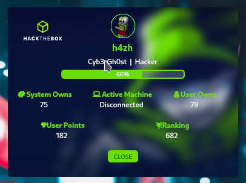

# HTB Profile Module Polybar

En mi caso lo utilizo en conjunto con el script de HTB de S4vitar.<br>



Para utilizarlo se debe tener ya un modulo en nuestra Polybar en el cual podamos hacer click. En mi caso utilizo uno proporcionado por S4vitar que es para ver nuestra IP de HackTheBox.
Lo unico que se hace es agregar la linea  ```click-left = ~/.config/polybar/extra-modules/htb_profile/htb_profile.sh &``` apuntando hacia el script.
Importante mencionar que el script debe estar junto con ```htb_profile.py``` y ```background.png```. En caso de que no quieran el background, se elimina y pueden poner uno de su preferencia, pero debe tener el nombre "background.png".
Modulo modificado agregando el "click-left":
```
[module/htb_status]
type = custom/script
interval = 2
format-foreground = ${color.BACKGROUND}
format-background = ${custom.HTB}
exec = ~/.config/polybar/extra-modules/htb_status.sh
click-left = ~/.config/polybar/extra-modules/htb_profile/htb_profile.sh &
```
